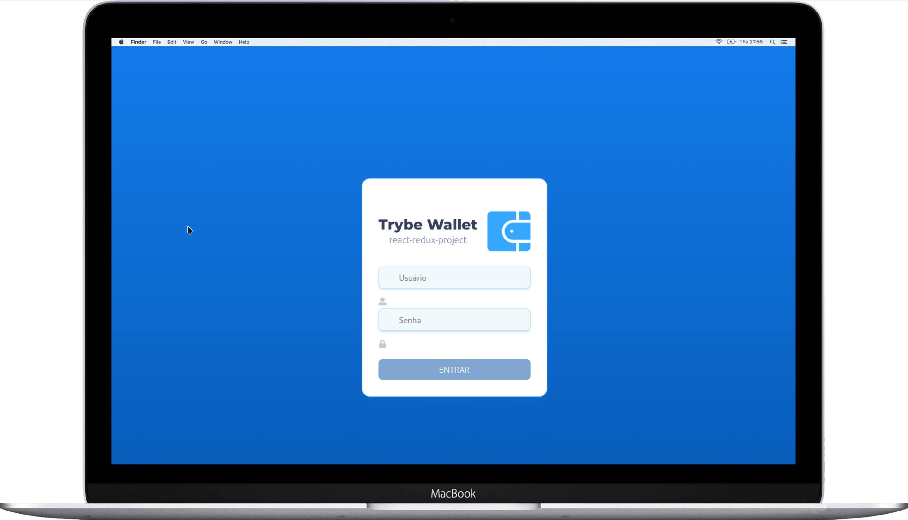
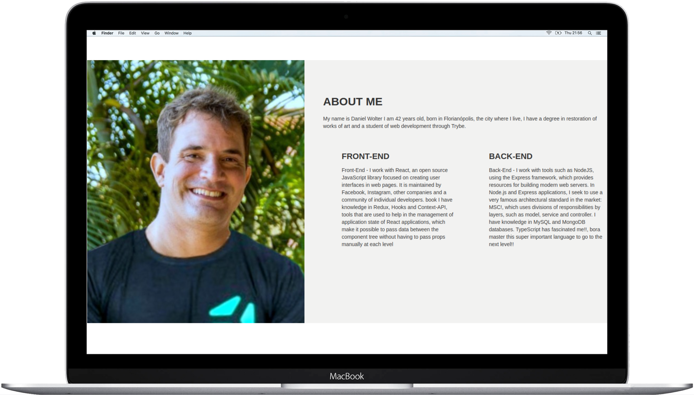

Hi, i’m **Daniel Wolter**, i'm from Florianópolis-Brazil, **Fullstack developer**.  

**LinkedIn🔗** 

**HackerRank🔗** 

**Email🔗** wolter.daniel@gmail.com
  

##

<h3> 🔧 Tech and tools that I know:<h3>

  
  
  
  
  
  
 

  
  
  
  
  
 

  
  
  
  
 

  
  
  
  
  
 

  
  
  
 

  
  
  
  
  
  

  
  
  
  
  
  
 

  

 
 

##

   
  

 
  
**FreeTime** - 🎨 I’m Restorer of Art (restoration of sculptures and mosaics)  [🔗Art-Restorer-FaceBook](https://www.facebook.com/profile.php?id=100064245002972).
 ##

  
<h1 align="center">Main Projects</h1>

<table>
    <tr>
    <td valign="top" width="50%">
      <h2 align="center"><a href="https://wolterwallet.vercel.app">App Trybe Wallet</a></h2>
      
       
      
<em><strong> Tools/Methodologies:</strong> React (functional components), Context API, HTML, CSS, Bootstrap, JavaScript</em>

      <h4><a href="https://github.com/D-Wolter/Projeto-Trybe-Wallet"><strong> Repository</strong> - App-Front-End - Trybe Wallet</a></h4>
    </td>
<td valign="top" width="50%">
      <h2 align="center"><a href="https://taotaodoce.vercel.app">App Recipes Mobile</a></h2>
      
       
      
<em><strong> Tools/Methodologies:</strong> React (functional components), Context API, HTML, CSS, Bootstrap, JavaScript</em>

      <h4><a href="https://github.com/D-Wolter/Projeto-Aplicativo-Receitas/"><strong> Repository</strong> - App-Front-End -  Recipes Mobile</a></h4>
    </td>
  </tr>
  <tr>
    <td valign="top" width="50%">
      <h2 align="center"><a href="https://d-wolter-github-io.vercel.app//">Portfolio</a></h2>
      
       
       
      
<em><strong> Tools/Methodologies:</strong> HTML, CSS</em>

      <h4><a href="https://github.com/D-Wolter/D-Wolter.github.io"><strong> Repository</strong> - My Personal Portfolio</a></h4>
    </td>
        <td valign="top" width="50%">
      <h2 align="center"><a href="https://restaurante-arvoredo.vercel.app/">Restaurant Arvoredo Page</a></h2>
      
       
       
      
<em><strong> Tools/Methodologies:</strong> HTML, CSS</em>

      <h4><a href="https://github.com/D-Wolter/Restaurante-Arvoredo"><strong> Repository</strong> - Restaurant Arvoredo Site</a></h4>
    </td>
    
  </tr>
</table>

